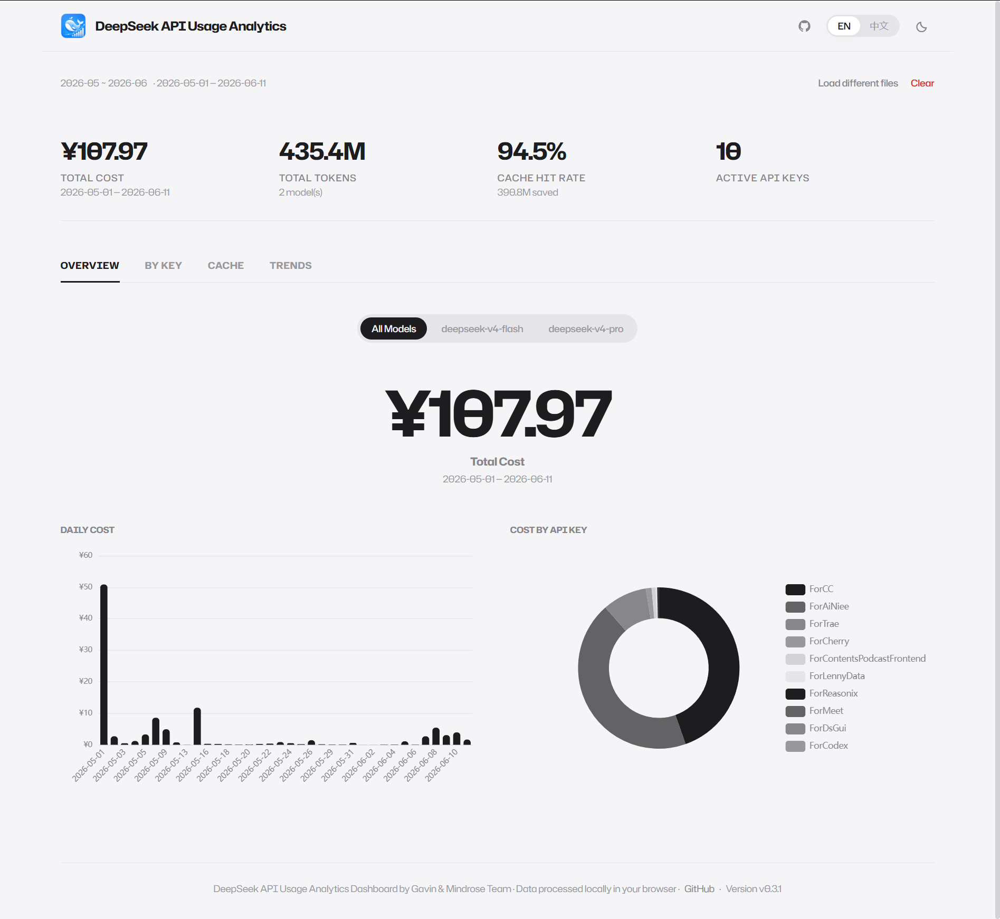

# DeepSeek API Usage Analytics Dashboard by Gavin & Mindrose Team

<p align="center">
  
</p>

A browser-side analytics dashboard for DeepSeek API usage. Drag your monthly CSV exports onto the page and get instant cost charts, per-key breakdowns, cache analysis, and usage trends — all processed locally in your browser. No server, no upload, no signup.

> [中文版](README_zh.md)

## Sister Project

If you also analyze Agnes AI usage, check the companion open-source project in the same tool family:

- GitHub: [Agnes AI Usage Analytics Repo](https://github.com/GavinCnod/agnes-api-usage-analysis)
- Website: [Agnes AI Usage Analytics](https://agnes-usage.xyz)

## How it works

1. Go to [DeepSeek Platform](https://platform.deepseek.com) → Usage → Export monthly data
2. Each month downloads as a ZIP archive containing `amount-{year}-{month}.csv` and `cost-{year}-{month}.csv`
3. Drag ZIP files (or extracted CSVs) onto the dashboard — multiple months auto-pair
4. Charts render instantly — nothing leaves your browser



## Features

- **Overview** — KPI big numbers (cost, tokens, cache rate, active keys) + daily cost bar chart + cost-by-key donut chart
- **By Key** — Detailed table with per-key tokens, cost, color-coded cache hit rate (green > 40% / amber 20–40% / red < 20%), request counts, and inline usage bars
- **Cache** — Large-format hit rate display, daily cache hit rate trend line, stacked hits-vs-misses bar chart by key with hit% labels and tooltip
- **Trends** — Toggleable multi-metric line chart (cost / tokens / cache hit rate / requests) with dynamic hero number
- **Dark mode** — Full light/dark dual-theme with CSS custom properties; auto-detects system preference, manual toggle persisted to localStorage
- **Multi-language** — English and 中文, auto-detected from browser language; manual switch with localStorage persistence
- **By Project** — Custom project grouping tab: drag-and-drop API keys into user-defined projects, per-project cost/token/cache aggregation, config persisted to localStorage; gear icon opens drag-and-drop config modal with keyboard-accessible dropdowns
- **Model filter** — Segmented control (pill buttons) to filter all views by model; only shown when ≥2 models detected
- **One-click copy** — Reusable CopyButton component for clipboard copy of cost values across KeyView, ProjectView, and OverviewView; hover tooltip with i18n-aware toast
- **Social share cards** — Generate 1200×630 infographic share images for each dashboard tab (Overview / Projects / Keys / Cache / Trends). Customizable "From XXX" signature, optional quote message, per-tab ECharts mini-charts, QR code to deepseek-usage.xyz, app logo watermark, one-click copy to clipboard (paste directly to WeChat / Feishu / DingTalk), and PNG download.
- **Upload safety** — 50MB per-file size limit to prevent ZIP bomb attacks; user-facing error messages and dedicated FAQ entry
- **Multi-month support** — Drag multiple months at once; files auto-pair by filename pattern and concatenate. Also supports ZIP archives directly — no extraction needed; drag DeepSeek platform ZIP exports straight onto the page.
- **Apple-minimalist design** — Cold gray paper-texture background, generous whitespace, "no-card" full-width modules, thin horizontal dividers, 5rem hero numbers, diffuse shadows
- **100% private** — All CSV parsing (Papa Parse), ZIP extraction (JSZip), and cost computation runs client-side; project configuration stored in your browser's localStorage only
- **SEO optimized** — Server-rendered metadata (canonical URLs, OpenGraph with alternateLocale, Twitter cards), JSON-LD structured data (SoftwareApplication + FAQPage + BreadcrumbList, bilingual), robots.txt + sitemap.xml, `<noscript>` crawler fallback content, anchor-linkable landing page sections, `llms.txt` for LLM-friendly site description
- **Sister project cross-linking** — Centralized `sisterProjects.ts` module manages cross-links between the two sibling tools in the "API Usage Analyzer Series" product family (DeepSeek + Agnes). All cross-site URLs flow through a single config source with UTM tracking (`utm_source=agnes_site`, `utm_medium=referral`, per-location `utm_campaign`). Sister project links appear in the TitleBar (pill button), LandingPage (dedicated section), FooterBar ("Related Tools" row), and Organization JSON-LD schema.
- **Landing page** — Complete pre-upload landing with theme-aware background images, Sister Project section (Agnes AI cross-link with tracked UTM URLs), How It Works steps, accordion FAQ (9 items, including file size limits and project grouping), expanded multi-section About (project origin, privacy & tech, team, contact with email copy & social links + "View Changelog →" link), scroll-reveal animations, anchor-linkable sections with deferred rendering for performance
- **User Guide** — Comprehensive bilingual user manual at `/guideline` with annotated screenshots, interactive table of contents, step-by-step dashboard navigation, CSV export instructions, chart interpretation guide, and troubleshooting section
- **Changelog** — Dedicated `/changelog` page with complete version history (v0.1.0–v0.5.4) organized by category (Added/Improved/Fixed/Dependencies) with color-coded dots; Apple-minimalist bilingual design matching privacy/terms pages, JSON-LD WebPage schema, independent SEO metadata, linked from TitleBar, FooterBar, and LandingPage
- **Privacy Policy & Terms** — `/privacy` and `/terms` pages with bilingual legal content, independent SEO metadata (canonical, OpenGraph, Twitter), JSON-LD WebPage schemas, and Apple-minimalist legal-text layout; linked from footer on every page
- **Analytics** — Optional Google Analytics 4 integration via `NEXT_PUBLIC_GA_ID` env var; zero overhead when unset. Tracks page views, file uploads, share card generations, tab switches, and language switches — zero CSV data ever tracked.
- **Enhanced SEO** — Twitter `summary_large_image` card with 1200×630 OG image, `Organization` JSON-LD schema for Google Knowledge Panel, expanded `BreadcrumbList` with all sub-pages, differentiated sitemap `lastModified` dates, `keywords` + `author` + `twitter:site`/`creator` meta tags on all pages
- **Community ready** — `CONTRIBUTING.md`, `CODE_OF_CONDUCT.md`, Issue templates (bug report + feature request), and Pull Request template to welcome contributors
- **Error resilience** — Graceful error handling for ZIP/CSV processing failures with user-visible error messages and retry capability; parser crash protection in DataContext
- **Accessibility** — All charts have descriptive `aria-label` attributes; responsive hero text scales from `text-5xl` on mobile to `text-[5rem]` on desktop; empty-state messages when filtered data is zero

## CSV Format

Standard DeepSeek platform export:

### `amount-{year}-{month}.csv`

| Column         | Description                                                                           |
| -------------- | ------------------------------------------------------------------------------------- |
| `utc_date`     | Usage date                                                                            |
| `model`        | `deepseek-chat`, `deepseek-reasoner`, etc.                                            |
| `api_key_name` | Your key label                                                                        |
| `api_key`      | Key (masked)                                                                          |
| `type`         | `request_count`, `output_tokens`, `input_cache_hit_tokens`, `input_cache_miss_tokens` |
| `price`        | Unit price in CNY                                                                     |
| `amount`       | Token or request count                                                                |

### `cost-{year}-{month}.csv`

| Column     | Description                |
| ---------- | -------------------------- |
| `utc_date` | Charge date                |
| `model`    | Model name                 |
| `cost`     | Amount (negative = charge) |
| `currency` | CNY                        |

## Development

```bash
npm install
npm run dev        # Dev server at localhost:3000
npm run build      # Static export → out/
npm run lint       # ESLint
npm test           # Vitest (21 tests)
```

### Tech Stack

| Layer       | Technology                              |
| ----------- | --------------------------------------- |
| Framework   | Next.js 16 (App Router, static export)  |
| UI          | React 19                                |
| Charts      | ECharts 6 + echarts-for-react           |
| CSV Parsing | Papa Parse 5                            |
| ZIP Handling| JSZip                                    |
| Screenshot  | html2canvas                             |
| QR Code     | qrcode                                   |
| Styling     | Tailwind CSS v4 + CSS custom properties |
| Typography  | Hubot Sans (local WOFF2) + Geist Mono (next/font/google) |
| Language    | TypeScript 5 (strict mode)              |

### Project Structure

```
src/
├── app/                    # Next.js App Router
│   ├── layout.tsx          # Root layout, generateMetadata() SEO, JSON-LD scripts, Google Analytics, providers
│   ├── page.tsx            # Entry → <Dashboard />
│   ├── guideline/
│   │   └── page.tsx        # /guideline route with independent SEO metadata
│   ├── privacy/
│   │   └── page.tsx        # /privacy route with independent SEO metadata
│   ├── terms/
│   │   └── page.tsx        # /terms route with independent SEO metadata
│   ├── changelog/
│   │   └── page.tsx        # /changelog route with independent SEO metadata
│   ├── globals.css         # Tailwind v4 + Hubot Sans @font-face + CSS variables + reveal/accordion + base styles
│   ├── AppI18nShell.tsx    # i18n shell + <html lang> sync
│   ├── robots.ts           # Build-time robots.txt generation
│   └── sitemap.ts          # Build-time sitemap.xml generation (includes /, /guideline, /privacy, /terms, /changelog)
├── components/
│   ├── TitleBar.tsx         # Shared top nav bar (logo + app name + Agnes sister-project pill + GitHub + guide book icon + changelog clock icon + language + theme)
│   ├── FooterBar.tsx        # Shared footer ("Related Tools" sister-project links row + copyright + guideline link + privacy link + terms link + changelog link + GitHub link + version, optional animate/reveal)
│   ├── LandingPage.tsx      # Landing page (Hero with theme images + Sister Project section + Upload + HowItWorks + "View Full Guide" link + accordion QA + About, scroll-reveal)
│   ├── LandingContent.tsx   # Server-rendered <noscript> fallback for SEO crawlers
│   ├── GuidelinePage.tsx    # Full interactive user guide (bilingual, annotated screenshots, table of contents, scroll-reveal)
│   ├── PrivacyPage.tsx      # Privacy policy page (bilingual 7-section legal text, JSON-LD WebPage schema, GitHub source links)
│   ├── TermsPage.tsx        # Terms of use page (bilingual 8-section legal text, JSON-LD WebPage schema, MIT License reference)
│   ├── ChangelogPage.tsx     # Changelog page (complete version history v0.1.0–v0.5.4, entries by category with colored dots, JSON-LD WebPage schema, bilingual)
│   ├── PrivacyContent.tsx    # <noscript> SEO fallback: bilingual privacy policy for crawlers
│   ├── TermsContent.tsx      # <noscript> SEO fallback: bilingual terms of use for crawlers
│   ├── ChangelogContent.tsx  # <noscript> SEO fallback: bilingual changelog version summary for crawlers
│   ├── CopyButton.tsx       # Reusable clipboard copy button (hover tooltip, i18n toast, timer cleanup)
│   ├── ShareButton.tsx      # Share icon button in tab nav → opens ShareModal
│   ├── ShareCard.tsx         # 1200×630 social media infographic card (per-tab KPI + mini-chart + QR + watermark)
│   ├── ShareModal.tsx        # Share dialog (live preview, inputs, copy to clipboard, PNG download)
│   ├── Dashboard.tsx        # Routes between LandingPage and 5-tab dashboard view (semantic hidden H1)
│   ├── DropZone.tsx         # Drag-and-drop or click-to-upload CSV/ZIP (multi-file, 50MB limit)
│   ├── ProjectView.tsx      # By Project tab: drag-and-drop custom project groups, per-project cost/token/cache table
│   ├── KPICards.tsx         # Summary stat cards
│   ├── OverviewView.tsx     # Hero cost + daily bars + donut
│   ├── KeyView.tsx          # Hero key count + detailed table
│   ├── CacheView.tsx        # Hero hit rate + trends + stacked bars
│   ├── TrendsView.tsx       # Hero dynamic metric + line chart
│   ├── ErrorDisplay.tsx     # Parse error & warning banners
│   ├── LanguageSwitcher.tsx # EN / 中文 toggle (pill segmented control)
│   └── ThemeSwitcher.tsx    # Light / Dark toggle (SVG icon button)
├── i18n/
│   ├── index.ts            # Barrel export
│   ├── I18nProvider.tsx    # React context + useTranslation hook
│   └── translations.ts     # All UI strings (en + zh, including projects, changelog, and guideline groups)
└── lib/
    ├── types.ts            # TypeScript interfaces & types
    ├── parser.ts           # CSV parsing pipeline
    ├── concatFiles.ts      # Multi-month CSV/ZIP pairing, extraction & concat + 50MB size limit
    ├── format.ts           # Locale-aware formatters
    ├── schema.ts           # JSON-LD structured data (SoftwareApplication + FAQPage + BreadcrumbList, bilingual, versioned)
    ├── DataContext.tsx      # Data state + model filter
    ├── ProjectConfigContext.tsx # Custom project grouping config (drag-and-drop, localStorage persistence)
    ├── shareCardData.ts     # Share card data extraction (per-tab summary data from ParseResult)
    ├── analytics.ts         # GA4 event tracking helper (shared gtag wrapper with guard)
    ├── sisterProjects.ts    # Sister project cross-linking config (Agnes/DeepSeek brand info, tracked URLs with UTM params)
    └── ThemeContext.tsx     # Theme state + useTheme hook
├── __tests__/
│   ├── analytics.test.ts    # trackEvent unit tests
│   ├── schema.test.ts       # Organization + BreadcrumbList schema tests
│   ├── sitemap.test.ts      # Sitemap lastModified differentiation tests
│   ├── DataContext.test.tsx # loadFiles error handling tests
│   └── DropZone.test.tsx    # Upload error display tests
```

## Design System

The dashboard follows an **Apple-minimalist** design language driven entirely by CSS custom properties:

- **30+ theme tokens** — background, text (3 levels), border, accent, semantic colors (positive/danger/warning), error/warning banners, chart colors, dropzone states
- **Light theme**: `#F5F5F7` cold gray paper background, `#1D1D1F` matte black text
- **Dark theme**: `#000000` pure black background, `#F5F5F7` white text
- **Typography**: Hubot Sans, weight 400 body / 500–700 headings, tight letter-spacing
- **Hero pattern**: `5rem` bold numbers in Overview / Keys / Cache / Trends — prominent, data-first presentation; responsive scaling (`text-5xl sm:text-6xl md:text-[5rem]`) prevents overflow on mobile
- **No-card layout**: Full-width modules separated by `1px solid var(--border)` dividers
- **Micro-interactions**: Subtle hover transitions (200ms), fade-in/slide-up animations, scroll-reveal sections with Intersection Observer, accordion QA panels
- **Custom scrollbar**: 6px thin, transparent track, themed thumb
- **Accessibility**: Respects `prefers-reduced-motion`, `color-scheme` for native UI, `focus-visible` outlines, `aria-expanded`/`aria-controls` on interactive elements

## SEO

The app implements a multi-layered SEO strategy for a client-rendered static SPA:

- **generateMetadata()** — Dynamic server-rendered metadata: canonical URL, OpenGraph (title, description, image), Twitter card, hreflang alternates (en/zh), robots directives
- **JSON-LD structured data** — `SoftwareApplication` + `FAQPage` + `BreadcrumbList` + `Organization` schemas in both English and Chinese (8 total script tags), injected at build time via `<script type="application/ld+json">` in `layout.tsx`; `Organization` schema enables Google Knowledge Panel brand recognition
- **robots.txt + sitemap.xml** — Generated at build time via Next.js 16 `MetadataRoute` conventions; sitemap includes `/`, `/guideline`, `/privacy`, `/terms`, and `/changelog` entries; site URL from `NEXT_PUBLIC_SITE_URL` env var
- **`<noscript>` fallback** — `LandingContent.tsx` outputs key landing page content (How It Works, FAQ, About) for crawlers that don't execute JavaScript; `PrivacyContent.tsx`, `TermsContent.tsx`, and `ChangelogContent.tsx` provide bilingual `<noscript>` fallbacks for the privacy, terms, and changelog pages (EEAT trust signals)
- **`llms.txt`** — LLM-friendly site description served at `/llms.txt`, summarizing the app's purpose, features, and structure for AI tools
- **Semantic HTML** — Visible `<h1>` on landing page and guideline page, `<h1 className="sr-only">` on dashboard, proper section structure

## Deploy

Static output — deploy to any static host:

```bash
npm run build
# out/ → Vercel, Netlify, GitHub Pages, Cloudflare Pages, etc.
```

Set `NEXT_PUBLIC_SITE_URL` to your production domain for correct canonical URLs, sitemap, and OpenGraph metadata. Optionally set `NEXT_PUBLIC_GA_ID` to your Google Analytics 4 measurement ID for page-view tracking. For sister project cross-linking, set `NEXT_PUBLIC_AGNES_SITE_URL` (Agnes site URL) and `NEXT_PUBLIC_AGNES_GITHUB_URL` (Agnes GitHub repo URL).

### Vercel Deployment

The repo includes `vercel.json` with pre-configured security headers and caching:

- **Security**: `X-Content-Type-Options`, `X-Frame-Options`, `Strict-Transport-Security`, `Content-Security-Policy`, `Referrer-Policy`, `Permissions-Policy` — all set to production-safe values
- **Caching**: immutable caching for `/_next/static` and `/fonts` (1 year), stale-while-revalidate for `/landing` and `/guideline` images (1 week)

## Changelog

### v0.5.4

**Added:**

- Sister project cross-linking — centralized `src/lib/sisterProjects.ts` module for the "API Usage Analyzer Series" product family (DeepSeek + Agnes). Agnes AI pill button in TitleBar, dedicated Sister Project section on LandingPage, "Related Tools" row in FooterBar, and expanded Organization JSON-LD schema (`sameAs` + `brand`). All cross-site links include UTM tracking (`utm_source=agnes_site`, `utm_medium=referral`, per-location `utm_campaign`).

**Improved:**

- Improved the token count number display format in Chinese Language.

### v0.5.3

**Added:**

- Enhanced SEO — Twitter card upgraded to `summary_large_image` with 1200×630 OG social preview image; added `keywords`, `twitter:site`/`creator`, and `author` meta tags to all pages.
- Organization JSON-LD structured data for Google Knowledge Panel brand recognition; expanded BreadcrumbList with all sub-page entries.
- GA4 conversion events — `upload_csv`, `share_card`, `tab_switch`, and `language_switch` event tracking via shared `trackEvent()` analytics helper.
- Community infrastructure — `CONTRIBUTING.md`, `CODE_OF_CONDUCT.md`, GitHub Issue templates (bug report + feature request), and Pull Request template.

**Improved:**

- Responsive hero numbers — hero text now scales down on mobile screens (`text-5xl → sm:text-6xl → md:text-[5rem]`), preventing horizontal overflow.
- Chart accessibility — all ECharts instances now have descriptive `aria-label` attributes for screen readers.
- Sitemap lastModified dates — now differentiated per route; privacy/terms use `yearly` change frequency with historical dates.

**Fixed:**

- Critical: DropZone error handling — added missing `catch` clause for ZIP/CSV processing errors. Previously, a corrupt file or extraction failure left the UI stuck in an infinite "Processing" spinner. Now shows a user-visible error message with retry capability.
- DataContext parser crash protection — wrapped `parseDeepSeekData()` in `try/catch` inside the `setTimeout` callback. Previously, a synchronous parser crash would fail silently with no user feedback.
- Empty states — OverviewView, KeyView, TrendsView, and ProjectView now show descriptive empty-state messages when data is empty after model filtering.

**Dependencies:**

- Added `vitest`, `@testing-library/react`, `@testing-library/jest-dom`, `jsdom`, and `@vitejs/plugin-react` for test infrastructure. 21 tests across 5 test files.

### v0.5.2

**Added:**

- Social media share cards — each dashboard tab (Overview / Projects / Keys / Cache / Trends) can now generate a 1200×630 infographic share image. Supports customizable "From XXX" signature, optional quote message, per-tab ECharts mini-charts, QR code pointing to deepseek-usage.xyz, app logo watermark, one-click copy to clipboard (paste directly to WeChat / Feishu / DingTalk), and PNG download.

**Dependencies:**

- Added `html2canvas` (DOM-to-canvas screenshot) and `qrcode` (client-side QR code generation).

### v0.5.1

**Added:**

- Changelog page (`/changelog`) — a dedicated page showcasing the complete version history, in Apple-minimalist bilingual design matching privacy/terms pages. Includes JSON-LD WebPage schema, independent SEO metadata (canonical, OpenGraph, Twitter), and version entries organized by category (Added/Improved/Fixed/Dependencies) with color-coded dots.
- TitleBar clock icon linking to the changelog page, alongside the existing guideline book icon.
- LandingPage About section "View Changelog →" link below the social link pills.

**Improved:**

- TitleBar tooltips (User Guide, Changelog) now properly support i18n, displaying localized text in both English and Chinese.
- Sitemap (`sitemap.xml`) expanded with `/changelog` entry (priority 0.5, monthly change frequency).
- Translation system extended with `changelog.*` group (en + zh).

### v0.5.0

**Added:**

- ZIP file upload support — users can now drag DeepSeek platform ZIP exports directly into the dashboard. ZIP archives containing CSV files are automatically extracted and processed in-browser. Huge thanks to [@taylord0ng](https://github.com/taylord0ng) for this contribution.
- Custom project grouping for API keys — a new "By Project" tab lets you organize API keys into user-defined project groups via drag-and-drop, with per-project cost aggregation, token usage tracking, and cache hit rate analysis. Inspired by [@taylord0ng](https://github.com/taylord0ng).
- Project configuration modal — drag-and-drop interface for assigning keys to custom projects, with local persistence via `localStorage`, reset-to-default, empty-state prompts, keyboard-friendly operation, and dropdown menus for unassigned keys.
- Reusable CopyButton component — encapsulated clipboard copy logic with hover tooltip and i18n-aware success messages. All inline copy functionality (KeyView, ProjectView) now uses this shared component.
- One-click cost copy — copy total cost from the Overview hero number with a single click.
- 50MB per-file upload size limit — protects against accidental or malicious oversized file uploads (e.g., ZIP bombs) that could freeze the browser. Includes user-facing warning prompts and a dedicated FAQ entry.

**Improved:**

- Upload validation — file size check with clear error messaging, duplicate project name validation with inline hints, and unsaved-changes confirmation dialog when closing the project config modal.
- Keyboard accessibility — full keyboard navigation support in the project configuration modal: Enter to confirm, Escape to close, arrow keys to navigate, plus on-screen keyboard shortcut hints.
- UI polish — fixed drag highlight state glitch in project key lists, resolved React key warnings in config lists, adjusted modal layout for better visual balance.
- i18n coverage — all new UI elements (project view, copy button, upload limits, config modal) fully translated in both English and Chinese.
- Fixed CopyButton timer memory leak — timers now properly cleaned up on unmount, preventing stale state updates.
- User guide and landing page — updated FAQ (new entries for file size limits and project grouping), usage guide screenshots and documentation, and landing page copy to reflect new features.

**Dependencies:**

- Added `jszip` for client-side ZIP extraction.

### v0.4.0

**Added:**

- Privacy Policy page (`/privacy`) — bilingual (en/zh) legal content covering 7 sections: no data collection, local processing, Google Analytics (opt-in), third-party services, security, policy changes, and contact. Independent SEO metadata (canonical URL, OpenGraph, Twitter card), JSON-LD WebPage schema, Apple-minimalist legal-text layout with GitHub source links for transparency verification.
- Terms of Use page (`/terms`) — bilingual (en/zh) legal content covering 8 sections: as-is service, no warranty, not affiliated with DeepSeek, user data & responsibility, open source (MIT License), limitation of liability, changes to terms, and contact. Independent SEO metadata and JSON-LD WebPage schema.
- MIT LICENSE file — added to the project root for open-source licensing clarity.
- FooterBar now links to Privacy Policy and Terms of Use pages alongside Guideline, GitHub, and version.

**Improved:**

- Sitemap (`sitemap.xml`) expanded to include `/privacy` and `/terms` entries (priority 0.5, monthly change frequency).
- Translation system extended with `privacy.*` (21 keys) and `terms.*` (22 keys) groups in both English and Chinese.
- SEO metadata: `NEXT_PUBLIC_SITE_URL` now injected into privacy and terms page metadata generation.

### v0.3.3

**Fixed:**

- Cache hit rate chart accumulation bug in TrendsView: daily ratios were incorrectly summed instead of computing hit/(hit+miss) from raw token totals, causing values to potentially exceed 100%.

**Added:**

- Cache hit rate percentage display on the hits-vs-misses stacked bar chart in CacheView: hit rate shown in tooltip and as labels on top of each key's bar.
- `vercel.json` with production security headers (CSP, HSTS, X-Frame-Options, etc.) and optimized static asset caching rules.

### v0.3.2

**Added:**

- User Guide page (`/guideline`) — comprehensive usage documentation covering dashboard overview, CSV export, data upload, chart interpretation, and troubleshooting; bilingual (en/zh) with annotated screenshots.
- Guideline navigation links in TitleBar (book icon), FooterBar (text link), and LandingPage (below How It Works section).
- 3 new FAQ entries (Q5–Q7): "Why does my cost show as $0?", "What does Incomplete Upload mean?", and "Where can I find more troubleshooting help?".
- Dashboard overview screenshot and logo in README files (en + zh).

**Improved:**

- SEO: added `/guideline` to sitemap.xml.
- JSON-LD FAQPage schema expanded with Q5–Q7 entries (bilingual).
- Added `/docs/` to `.gitignore`.

### v0.3.1

**Added:**

- JSON-LD BreadcrumbList schema (bilingual en/zh) for better search engine understanding of site structure.

**Improved:**

- SEO: extended Chinese `meta.description` with privacy and team info (~100 characters, up from ~37).
- SEO: added `alternateLocale: ["zh_CN"]` to OpenGraph metadata, complementing existing hreflang alternates.
- SEO: added `id` attributes to landing page sections (`#how-it-works`, `#faq`, `#about`) for direct anchor linking.
- JSON-LD: added `version` field to `SoftwareApplication` schema.
- Performance: added `content-visibility: auto` to below-the-fold landing page sections (How It Works, FAQ, About) to reduce initial render cost.

### v0.3.0

**Added:**

- Rebuilt About section: expanded from a single paragraph into 4 themed subsections — Why We Built This, Under the Hood: Privacy & Tech, About MindRose, and Let's Work Together — each separated by dashed `<hr>` dividers.
- Email copy button in the Contact area: one-click clipboard copy (`navigator.clipboard.writeText` with textarea fallback), anti-scraping dynamic address concatenation, and SVG checkmark copy feedback with 2s toast.
- Social link pills: GitHub repository, Gavin's LinkedIn, and MindRose website — each with themed SVG icons, `rounded-subtle` borders, and hover background.

**Improved:**

- Landing page sections now separated by thin horizontal `<hr>` dividers for clearer visual hierarchy.
- QA accordion section centered with `max-w-2xl` for better readability on wide viewports.
- TitleBar `z-index` raised to `z-50` to guarantee it stays above all content.
- Landing page sections use `pt-10` top padding (previously `pt-0`) for consistent spacing around dividers.
- Added 14 new `landing.*` translation keys (en + zh) for all About sub-sections.
- Rebranded site title to "DeepSeek API Usage Analytics Dashboard by Gavin & Mindrose Team" across metadata, JSON-LD schema, footer, and translations.
- Fixed landing page heading hierarchy: section titles upgraded from `<h3>` to `<h2>`, sub-section titles from `<h4>` to `<h3>`.

### v0.2.3

**Added:**

- Full-site SEO: `generateMetadata()` with canonical URLs, OpenGraph, Twitter cards, and hreflang alternates.
- JSON-LD structured data: bilingual `SoftwareApplication` + `FAQPage` schemas (via `src/lib/schema.ts`).
- `robots.txt` and `sitemap.xml` generation at build time (via `src/app/robots.ts` and `src/app/sitemap.ts`).
- `<noscript>` crawler fallback content (`LandingContent.tsx`) for search engines that don't execute JavaScript.
- Theme-aware landing page background images — CSV and chart sketches that swap with light/dark mode.
- Semantic hidden H1 on dashboard view for screen readers and SEO.

**Improved:**

- `layout.tsx` upgraded to `generateMetadata()` for dynamic build-time SEO injection.
- `LandingPage.tsx` now renders `LandingContent` for SEO and theme-aware background decoration.
- `FooterBar.tsx` extracted as standalone component with `animate` and `sectionRef` props.
- `TitleBar.tsx` extracted as standalone component with logo, GitHub icon, and unified layout.
- Added `warning` translation group (date mismatch, no cost match, partial cache data, schema drift).
- Updated DropZone component background styles for better drag-and-drop interaction.

### v0.2.2

**Added:**

- Logo icon and favicon.ico — added brand identity assets to TitleBar and browser tab.
- Replaced default English font with local Hubot Sans WOFF2 files (3 weights: 400/500/700).

**Improved:**

- Redesigned LanguageSwitcher as Apple-style pill segmented control with `role="radio"` accessibility.
- Redesigned ThemeSwitcher as SVG sun/moon icon button with hover background.
- Added GitHub icon link to TitleBar for quick repository access.
- FooterBar now displays app version number alongside copyright and GitHub link.
- DropZone now has a subtle themed background color (`--dropzone-bg`) instead of transparent.
- Landing page content container widened from `max-w-3xl` to `max-w-6xl` for better visual balance.
- Added scroll-reveal fade-in + slide-up animations on landing page sections via Intersection Observer.
- Added accordion expand/collapse animation for the QA section.
- Added mobile-friendly flex-wrap layout to FooterBar for small screen readability.
- Updated bilingual copy — refined upload area hint text and corrected ellipsis formatting.
- Added global accessibility styles: smooth scrolling, `prefers-reduced-motion` support, `color-scheme` for native UI, `focus-visible` outlines.

### v0.2.1

**Added:**

- Landing page — built a complete pre-upload landing page with Hero, upload area, How It Works steps, FAQ, and About sections.

### v0.2.0

**Added:**

- Full light/dark theme switching — refactored global CSS with custom properties for unified dual-theme color management.
- Model filter — added Apple-style segmented capsule filter in Dashboard, optimized UI and data presentation.

**Improved:**

- Refined overall UI interactions and visual styling.
- Refactored all view components to render from filtered data; added Hero big-number summary sections at the top of each view.

### v0.1.0

**Added:**

- Built the DeepSeek API usage analytics dashboard — implemented CSV parsing, multi-month file concatenation, and error validation logic; all data processing runs purely in the browser.
- Developed drag-and-drop upload component, data context layer, and multi-dimensional visualization dashboard.
- Added full i18n support with language switching, and refactored numeric formatting utilities to adapt unit display rules for different locales.

## License

MIT
