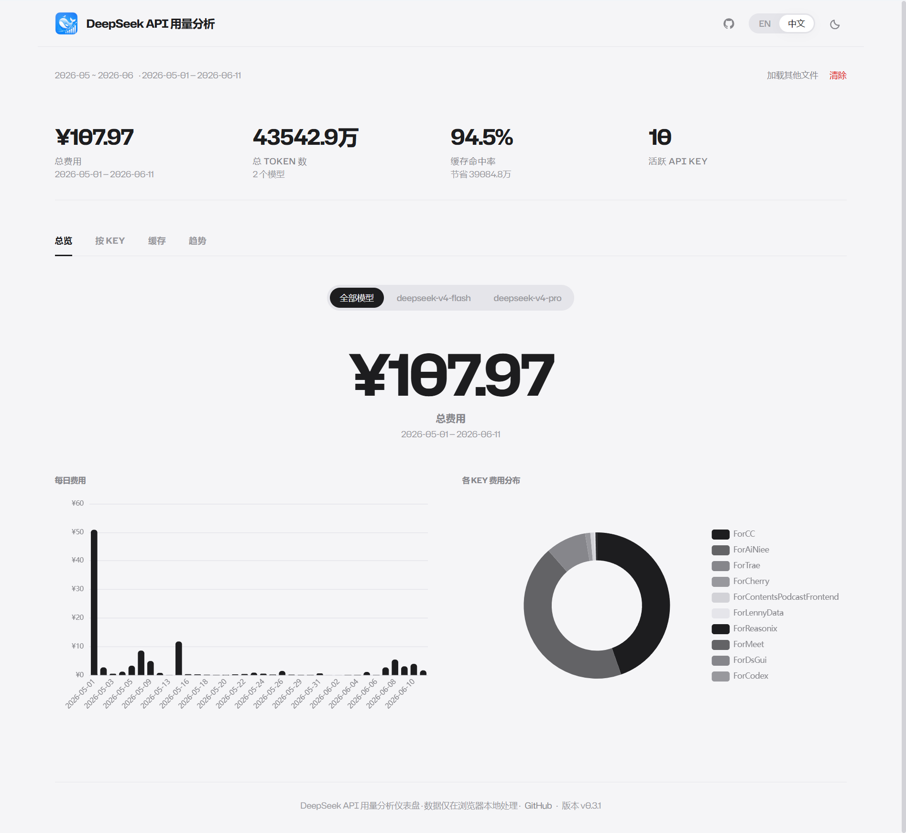

# DeepSeek API 用量分析仪表盘

<p align="center">
  
</p>

一款纯浏览器端的 DeepSeek API 用量分析仪表盘。将月度 CSV 导出文件拖拽到页面，即刻获取费用图表、各 Key 用量明细、缓存分析和用量趋势 — 所有数据均在浏览器本地处理。无需服务器、无需上传、无需注册。

> [English version](README.md)

## 使用方式

1. 前往 [DeepSeek 平台](https://platform.deepseek.com) → 用量 → 导出月度数据
2. 每月下载一个 ZIP 压缩包，内含 `amount-{年份}-{月份}.csv` 和 `cost-{年份}-{月份}.csv`
3. 将 ZIP 文件（或解压后的 CSV）拖拽到仪表盘 — 多个月份自动配对
4. 图表即刻渲染 — 数据不会离开你的浏览器



## 功能特性

- **总览** — KPI 大数字展示（费用、Token 数、缓存命中率、活跃 Key）+ 每日费用柱状图 + 各 Key 费用环形图
- **按 Key** — 详细表格，展示每个 Key 的 Token 数、费用、颜色标记的缓存命中率（绿色 > 40% / 琥珀色 20–40% / 红色 < 20%）、请求次数及内嵌用量条
- **缓存** — 大字号命中率展示、每日缓存命中率趋势折线图、各 Key 缓存命中/未命中堆叠柱状图（含命中率标签和 tooltip）
- **趋势** — 可切换多指标折线图（费用 / Token / 缓存命中率 / 请求次数），顶部大数字动态跟随指标切换
- **深色模式** — 完整的浅色/深色双主题，基于 CSS 自定义属性；自动检测系统偏好，手动切换持久化至 localStorage
- **多语言** — 英文和中文，根据浏览器语言自动检测；手动切换持久化至 localStorage
- **按项目** — 自定义项目分组标签页：拖拽 API Key 到用户自定义项目中，按项目汇总费用/Token/缓存数据，配置持久化至 localStorage；齿轮图标打开拖拽式配置弹窗，支持键盘操作下拉菜单
- **模型筛选** — 分段控件胶囊按钮，按模型过滤所有视图；仅在检测到 ≥2 个模型时显示
- **一键复制** — 可复用的 CopyButton 组件，在 KeyView、ProjectView 和 OverviewView 中一键复制费用数值；悬浮提示含国际化成功消息
- **上传安全** — 单文件 50MB 大小限制，防止 ZIP 炸弹攻击；用户可见的错误提示及专属 FAQ 条目
- **多月支持** — 一次拖入多个月份文件；根据文件名模式自动配对并拼接。同时支持 ZIP 压缩包直接上传 — 无需解压，直接将 DeepSeek 平台导出的 ZIP 文件拖入页面即可。
- **Apple 极简设计** — 冷灰纸质感底、大量留白、「无卡片」通栏模块布局、细横线分割、5rem Hero 大数字、弥散阴影
- **100% 隐私** — 所有 CSV 解析（Papa Parse）、ZIP 解压（JSZip）和费用计算均在浏览器客户端完成；项目配置仅存储于浏览器的 localStorage 中
- **SEO 优化** — 服务端渲染元数据（规范 URL、OpenGraph 含 alternateLocale、Twitter 卡片）、JSON-LD 结构化数据（SoftwareApplication + FAQPage + BreadcrumbList，双语）、robots.txt + sitemap.xml、`<noscript>` 爬虫回退内容、支持锚点链接的落地页板块、`llms.txt` 面向 LLM 的站点描述
- **落地页** — 完整的上传前落地页，包含主题感知背景图片、使用说明步骤、手风琴常见问题（9 项，含文件大小限制和项目分组）、多板块关于页面（项目起源、隐私与技术、团队介绍、商业合作含邮箱复制与社交链接 +「查看更新日志 →」链接）、滚动渐显动画、支持锚点链接的板块与延迟渲染性能优化
- **用户操作手册** — 位于 `/guideline` 的完整双语使用指南，包含标注截图、交互式目录导航、分步仪表盘操作说明、CSV 导出指引、图表解读和故障排查章节
- **更新日志** — 位于 `/changelog` 的专属页面，展示 v0.1.0 至 v0.5.1 的完整版本历史，按类别（新增/改进/修复/依赖变更）以彩色圆点分组；Apple 极简双语设计，与隐私政策/使用条款风格一致，含 JSON-LD WebPage 结构化数据、独立 SEO 元数据，可从 TitleBar、FooterBar 和落地页访问
- **隐私政策与使用条款** — `/privacy` 和 `/terms` 页面，包含双语法务内容、独立 SEO 元数据（规范 URL、OpenGraph、Twitter 卡片）、JSON-LD WebPage Schema 以及 Apple 极简风格的法律文本布局；每页页脚均有导航链接
- **数据分析** — 可选的 Google Analytics 4 集成，通过 `NEXT_PUBLIC_GA_ID` 环境变量控制；未设置时零开销，仅追踪标准页面浏览 — 绝不追踪任何 CSV 数据

## CSV 格式

DeepSeek 平台标准导出格式：

### `amount-{年份}-{月份}.csv`

| 列名             | 说明                                                                                 |
| -------------- | ---------------------------------------------------------------------------------- |
| `utc_date`     | 使用日期                                                                               |
| `model`        | 模型名称，如 `deepseek-chat`、`deepseek-reasoner`                                         |
| `api_key_name` | API Key 标签                                                                         |
| `api_key`      | Key（脱敏）                                                                            |
| `type`         | `request_count`、`output_tokens`、`input_cache_hit_tokens`、`input_cache_miss_tokens` |
| `price`        | 单价（人民币）                                                                            |
| `amount`       | Token 或请求数量                                                                        |

### `cost-{年份}-{月份}.csv`

| 列名         | 说明        |
| ---------- | --------- |
| `utc_date` | 扣费日期      |
| `model`    | 模型名称      |
| `cost`     | 金额（负数为扣费） |
| `currency` | 币种（CNY）   |

## 本地开发

```bash
npm install
npm run dev        # 开发服务器 → localhost:3000
npm run build      # 静态导出 → out/
npm run lint       # ESLint
```

### 技术栈

| 层级     | 技术                                 |
| ------ | ---------------------------------- |
| 框架     | Next.js 16（App Router，静态导出）        |
| UI     | React 19                           |
| 图表     | ECharts 6 + echarts-for-react      |
| CSV 解析 | Papa Parse 5                       |
| ZIP 处理 | JSZip                                    |
| 样式     | Tailwind CSS v4 + CSS 自定义属性        |
| 字体     | Hubot Sans（本地 WOFF2）+ Geist Mono（next/font/google） |
| 语言     | TypeScript 5（strict 严格模式）          |

### 项目结构

```
src/
├── app/                    # Next.js App Router
│   ├── layout.tsx          # 根布局、generateMetadata() SEO、JSON-LD 脚本、Google Analytics、Provider
│   ├── page.tsx            # 入口 → <Dashboard />
│   ├── guideline/
│   │   └── page.tsx        # /guideline 路由，包含独立 SEO 元数据
│   ├── privacy/
│   │   └── page.tsx        # /privacy 路由，包含独立 SEO 元数据
│   ├── terms/
│   │   └── page.tsx        # /terms 路由，包含独立 SEO 元数据
│   ├── changelog/
│   │   └── page.tsx        # /changelog 路由，包含独立 SEO 元数据
│   ├── globals.css         # Tailwind v4 + Hubot Sans @font-face + CSS 变量 + 渐显/手风琴 + 基础样式
│   ├── AppI18nShell.tsx    # i18n 外壳 + <html lang> 同步
│   ├── robots.ts           # 构建时 robots.txt 生成
│   └── sitemap.ts          # 构建时 sitemap.xml 生成（含 /、/guideline、/privacy、/terms、/changelog 条目）
├── components/
│   ├── TitleBar.tsx         # 共享顶部导航栏（Logo + 应用名 + GitHub + 操作手册书籍图标 + 更新日志时钟图标 + 语言 + 主题）
│   ├── FooterBar.tsx        # 共享页脚（版权 + 操作手册链接 + 隐私政策链接 + 使用条款链接 + 更新日志链接 + GitHub 链接 + 版本号，可选渐显动画）
│   ├── LandingPage.tsx      # 落地页（Hero 含主题背景图 + 上传 + 使用说明含「查看完整指南」链接 + 手风琴FAQ + 关于，滚动渐显）
│   ├── LandingContent.tsx   # 服务端渲染 <noscript> 回退内容，供搜索引擎爬虫抓取
│   ├── GuidelinePage.tsx    # 完整交互式用户操作手册（双语、标注截图、目录导航、滚动渐显）
│   ├── PrivacyPage.tsx      # 隐私政策页（双语 7 章节法律文本，JSON-LD WebPage Schema，GitHub 源码链接）
│   ├── TermsPage.tsx        # 使用条款页（双语 8 章节法律文本，JSON-LD WebPage Schema，MIT 许可证引用）
│   ├── ChangelogPage.tsx     # 更新日志页（v0.1.0–v0.5.2 完整版本历史，按类别以彩色圆点分组，JSON-LD WebPage Schema，双语）
│   ├── CopyButton.tsx       # 可复用剪贴板复制按钮（悬浮提示、国际化 Toast、定时器清理）
│   ├── Dashboard.tsx        # 路由：落地页 / 5 标签页仪表盘视图切换（语义化隐藏 H1）
│   ├── DropZone.tsx         # 拖拽或点击上传 CSV/ZIP（多文件，50MB 限制）
│   ├── ProjectView.tsx      # 按项目标签页：拖拽自定义项目分组，按项目汇总费用/Token/缓存表格
│   ├── KPICards.tsx         # 摘要指标卡片
│   ├── OverviewView.tsx     # Hero 费用 + 日柱状图 + 环形图
│   ├── KeyView.tsx          # Hero Key 数量 + 详细表格
│   ├── CacheView.tsx        # Hero 命中率 + 趋势 + 堆叠图
│   ├── TrendsView.tsx       # Hero 动态指标 + 折线图
│   ├── ErrorDisplay.tsx     # 解析错误 & 警告横幅
│   ├── LanguageSwitcher.tsx # EN / 中文 切换（胶囊分段控件）
│   └── ThemeSwitcher.tsx    # 浅色 / 深色 切换（SVG 图标按钮）
├── i18n/
│   ├── index.ts            # 统一导出
│   ├── I18nProvider.tsx    # React 上下文 + useTranslation Hook
│   └── translations.ts     # 全部 UI 文案（en + zh，含 projects、changelog 和 guideline 分组）
└── lib/
    ├── types.ts            # TypeScript 接口与类型定义
    ├── parser.ts           # CSV 解析管线
    ├── concatFiles.ts      # 多月 CSV/ZIP 配对、解压与拼接 + 50MB 大小限制
    ├── format.ts           # 本地化格式函数
    ├── schema.ts           # JSON-LD 结构化数据（SoftwareApplication + FAQPage + BreadcrumbList，双语，含版本号）
    ├── DataContext.tsx      # 数据状态 + 模型筛选
    ├── ProjectConfigContext.tsx # 自定义项目分组配置（拖拽分配，localStorage 持久化）
    └── ThemeContext.tsx     # 主题状态 + useTheme Hook
```

## 设计系统

仪表盘遵循 **Apple 极简主义** 设计语言，完全由 CSS 自定义属性驱动：

- **30+ 主题色值** — 背景、文字（3 级）、边框、强调色、语义色（正向/危险/警告）、错误/警告横幅、图表色、拖拽区状态色
- **浅色主题**：`#F5F5F7` 冷灰纸质感底，`#1D1D1F` 哑光黑文字
- **深色主题**：`#000000` 纯黑底，`#F5F5F7` 白色文字
- **字体**：Hubot Sans，正文 400 字重 / 标题 500–700 字重，紧凑字间距
- **Hero 模式**：总览/Key/缓存/趋势视图中 `5rem` 粗体大数字 — 数据优先的视觉呈现
- **无卡片布局**：通栏模块，以 `1px solid var(--border)` 细线分割
- **微交互**：细腻的 hover 过渡（200ms）、淡入/上滑动画、Intersection Observer 滚动渐显、手风琴折叠面板
- **自定义滚动条**：6px 细条，透明轨道，主题色滑块
- **无障碍**：遵循 `prefers-reduced-motion`、`color-scheme` 原生 UI、`focus-visible` 轮廓、`aria-expanded`/`aria-controls` 交互属性

## SEO 架构

本应用为客户端渲染的静态 SPA 实现了多层 SEO 策略：

- **generateMetadata()** — 动态服务端渲染元数据：规范 URL、OpenGraph（标题、描述、图片）、Twitter 卡片、hreflang 语言标注（en/zh）、robots 指令
- **JSON-LD 结构化数据** — `SoftwareApplication` + `FAQPage` + `BreadcrumbList` 双语 Schema（英文和中文，共 6 个 script 标签），构建时通过 `layout.tsx` 中的 `<script type="application/ld+json">` 注入
- **robots.txt + sitemap.xml** — 构建时通过 Next.js 16 `MetadataRoute` 约定生成；sitemap 包含 `/`、`/guideline`、`/privacy`、`/terms` 和 `/changelog` 五个条目；站点域名从 `NEXT_PUBLIC_SITE_URL` 环境变量读取
- **`<noscript>` 回退** — `LandingContent.tsx` 输出关键落地页内容（使用说明、常见问题、关于），供不执行 JavaScript 的爬虫抓取
- **`llms.txt`** — 面向 LLM 的站点描述，位于 `/llms.txt`，总结应用功能、特性与结构，供 AI 工具使用
- **语义化 HTML** — 落地页和操作手册页包含可见的 `<h1>`，仪表盘视图包含 `<h1 className="sr-only">`，配合正确的 section 结构

## 部署

静态输出，可部署到任何静态托管服务：

```bash
npm run build
# out/ → Vercel, Netlify, GitHub Pages, Cloudflare Pages 等
```

设置 `NEXT_PUBLIC_SITE_URL` 环境变量为你的生产环境域名，以确保正确的规范 URL、站点地图和 OpenGraph 元数据。可选择性设置 `NEXT_PUBLIC_GA_ID` 为 Google Analytics 4 测量 ID 以启用页面浏览追踪。

### Vercel 部署

仓库包含 `vercel.json`，预配置安全头与缓存规则：

- **安全**：`X-Content-Type-Options`、`X-Frame-Options`、`Strict-Transport-Security`、`Content-Security-Policy`、`Referrer-Policy`、`Permissions-Policy` — 均设为生产环境安全值
- **缓存**：`/_next/static` 和 `/fonts` 永久缓存（1 年），`/landing` 和 `/guideline` 图片 stale-while-revalidate 缓存（1 周）

## 更新日志

### v0.5.2

**新增：**

- 社交媒体分享卡片 — 每个仪表盘标签页（总览 / 项目 / Key / 缓存 / 趋势）现可生成 1200×630 信息图分享图片。支持自定义「From XXX」署名、可选引用文案、各标签页专属 ECharts 迷你图表、deepseek-usage.xyz 二维码、应用 Logo 水印、一键复制到剪贴板（直接粘贴至微信/飞书/钉钉）以及 PNG 下载。

**依赖变更：**

- 新增 `html2canvas`（DOM 转 Canvas 截图）和 `qrcode`（客户端二维码生成）依赖包。

### v0.5.1

**新增：**

- 更新日志页面（`/changelog`）— 专属页面展示 v0.1.0 至 v0.5.2 的完整版本历史，采用与隐私政策/使用条款一致的 Apple 极简双语设计。包含 JSON-LD WebPage 结构化数据、独立 SEO 元数据（canonical、OpenGraph、Twitter），版本条目按类别（新增/改进/修复/依赖）以彩色圆点分组展示。
- TitleBar 时钟图标链接至更新日志页面，与现有操作手册书籍图标并列。
- 落地页关于区域社交链接胶囊下方新增「查看更新日志 →」链接。

**改进：**

- TitleBar 悬浮提示（操作手册、更新日志）现正确支持多语言，中英文环境下显示对应本地化文本。
- sitemap.xml 扩展，新增 `/changelog` 条目（优先级 0.5，月度更新频率）。
- 翻译系统扩展，新增 `changelog.*` 分组（中英双语）。

### v0.5.0

**新增：**

- ZIP 文件上传支持 — 用户现可直接将 DeepSeek 平台导出的 ZIP 压缩包拖入仪表盘，内含的 CSV 文件将在浏览器端自动解压处理。感谢 [@taylord0ng](https://github.com/taylord0ng) 贡献此功能。
- 自定义项目分组管理 API 密钥 — 新增「按项目」标签页，支持通过拖拽将 API 密钥归入用户自定义的项目分组，提供按项目汇总的费用、Token 用量追踪及缓存命中率分析。灵感来自 [@taylord0ng](https://github.com/taylord0ng)。
- 项目配置弹窗 — 拖拽式界面，可将密钥分配至自定义项目，支持 localStorage 本地持久化、一键重置、空状态提示、键盘友好操作以及未分配密钥的下拉菜单。
- 通用 CopyButton 组件 — 封装剪贴板复制逻辑，含悬浮提示和国际化成功消息。KeyView 和 ProjectView 中的所有复制功能现已统一使用此共享组件。
- 费用一键复制 — 点击总览 Hero 区域的总费用大数字即可一键复制。
- 单文件 50MB 上传大小限制 — 防止意外或恶意超大文件（如 ZIP 炸弹）导致浏览器卡死，包含用户可见的警告提示和专属 FAQ 条目。

**改进：**

- 上传校验增强 — 文件大小检查并给出明确错误提示、项目名称重复校验及内联提示、关闭项目配置弹窗时的未保存修改确认对话框。
- 键盘无障碍 — 项目配置弹窗支持完整键盘导航：Enter 确认、Escape 关闭、方向键浏览，同时提供界面上可见的快捷键提示。
- UI 细节优化 — 修复项目密钥列表中拖拽高亮状态异常、解决配置列表 React key 警告、调整弹窗布局以获得更好的视觉平衡。
- 国际化覆盖 — 所有新增 UI 元素（项目视图、复制按钮、上传限制、配置弹窗）均已完善中英双语文案。
- 修复 CopyButton 定时器内存泄漏 — 组件卸载时正确清理定时器，避免过期状态更新。
- 用户操作手册与落地页 — 更新 FAQ（新增文件大小限制与项目分组相关条目）、使用指南截图与文档、落地页文案以反映新增功能。

**依赖变更：**

- 新增 `jszip` 依赖，用于浏览器端 ZIP 解压。

### v0.4.0

**新增：**

- 隐私政策页面（`/privacy`）— 双语（中/英）法律内容，涵盖 7 个章节：不收集数据、本地处理、Google Analytics（可选启用）、第三方服务、安全性、政策变更、联系我们。独立 SEO 元数据（规范 URL、OpenGraph、Twitter 卡片），JSON-LD WebPage Schema，Apple 极简风格法律文本布局，附 GitHub 源码链接以供透明验证。
- 使用条款页面（`/terms`）— 双语（中/英）法律内容，涵盖 8 个章节：按现状提供、免责声明、与 DeepSeek 无关、用户数据与责任、开源许可（MIT License）、责任限制、条款变更、联系我们。独立 SEO 元数据和 JSON-LD WebPage Schema。
- MIT LICENSE 文件 — 添加至项目根目录，明确开源许可协议。
- FooterBar 现同时链接至隐私政策和使用条款页面，与操作手册、GitHub、版本号并列。

**改进：**

- sitemap.xml 扩展，新增 `/privacy` 和 `/terms` 条目（优先级 0.5，月度更新频率）。
- 翻译系统扩展，新增 `privacy.*`（21 个键）和 `terms.*`（22 个键）分组，涵盖英文和中文。
- SEO 元数据：`NEXT_PUBLIC_SITE_URL` 现注入至隐私政策和使用条款页面的元数据生成中。

### v0.3.3

**修复：**

- 修复 TrendsView 中缓存命中率图表数据累加错误：每日比例值被错误累加，现已改为按原始 token 数量先累加再计算 hit/(hit+miss)，避免数值超过 100%。

**新增：**

- CacheView 的 hitsVsMisses 堆叠柱状图新增缓存命中率显示：tooltip 中展示百分比，柱状图顶部显示各 Key 的命中率标签。
- 新增 `vercel.json`，配置生产环境安全头（CSP、HSTS、X-Frame-Options 等）和静态资源缓存优化规则。

### v0.3.2

**新增：**

- 用户操作手册页面（`/guideline`）— 涵盖仪表盘总览、CSV 导出、数据上传、图表解读、故障排查的全面使用文档，双语（中/英）配标注截图。
- 操作手册导航入口：TitleBar（书籍图标）、FooterBar（文字链接）、LandingPage（使用说明区域下方）。
- 3 个新增常见问题（Q5–Q7）：「为什么费用显示为 0？」「显示"上传不完整"是什么意思？」「哪里可以找到更多故障排查帮助？」
- README 文件中添加仪表盘总览截图和 Logo（中英文版）。

**改进：**

- SEO：在 sitemap.xml 中新增 `/guideline` 条目。
- JSON-LD FAQPage Schema 扩充 Q5–Q7 条目（双语）。
- 在 `.gitignore` 中新增 `/docs/`。

### v0.3.1

**新增：**

- JSON-LD BreadcrumbList 面包屑 Schema（中英文双语），帮助搜索引擎理解页面在站点中的位置。

**改进：**

- SEO：扩展中文 `meta.description`，融入隐私说明和团队信息（约 100 字符，原 37 字符）。
- SEO：OpenGraph 元数据新增 `alternateLocale: ["zh_CN"]`，与 hreflang 语言标注相呼应。
- SEO：为落地页板块添加 `id` 属性（`#how-it-works`、`#faq`、`#about`），支持页面内锚点链接。
- JSON-LD：`SoftwareApplication` Schema 新增 `version` 字段（`0.3.1`）。
- 性能：为折叠区域下方的落地页板块（使用说明、常见问题、关于）添加 `content-visibility: auto`，减少初始渲染开销。

### v0.3.0

**新增：**

- 重构关于板块：从单一简介扩展为 4 个主题子板块 — 为什么开发这个工具、极致的隐私与技术架构、关于 MindRose、商业合作 — 各板块以虚线 `<hr>` 分割。
- 联系方式区域新增邮箱复制按钮：一键复制到剪贴板（`navigator.clipboard.writeText` 配合 textarea 降级方案），反爬虫动态拼接邮箱地址，SVG 对勾复制反馈 + 2 秒提示。
- 社交链接胶囊：GitHub 仓库、Gavin 的 LinkedIn、MindRose 官网 — 各含主题 SVG 图标、`rounded-subtle` 圆角边框和 hover 背景。

**改进：**

- 落地页各板块之间新增水平 `<hr>` 分割线，视觉层次更清晰。
- 常见问题手风琴区域使用 `max-w-2xl` 居中，宽屏下阅读体验更佳。
- TitleBar `z-index` 提升至 `z-50`，确保始终位于所有内容之上。
- 落地页板块统一使用 `pt-10` 顶部间距（原 `pt-0`），使分割线周围间距更一致。
- 为所有关于子板块新增 14 个 `landing.*` 翻译键（中英文）。
- 站点标题更新为 "DeepSeek API Usage Analytics Dashboard by Gavin & Mindrose Team"，同步更新元数据、JSON-LD Schema、页脚和翻译文案。
- 修复落地页标题层级：板块标题从 `<h3>` 升级为 `<h2>`，子板块标题从 `<h4>` 升级为 `<h3>`。

### v0.2.3

**新增：**

- 全站 SEO 优化：`generateMetadata()` 动态元数据（规范 URL、OpenGraph、Twitter 卡片、hreflang 语言标注）。
- JSON-LD 结构化数据：双语 `SoftwareApplication` + `FAQPage` Schema（通过 `src/lib/schema.ts` 生成）。
- 构建时 `robots.txt` 和 `sitemap.xml` 生成（通过 `src/app/robots.ts` 和 `src/app/sitemap.ts`）。
- `<noscript>` 爬虫回退内容（`LandingContent.tsx`），确保不执行 JavaScript 的搜索引擎也能抓取落地页文字。
- 落地页主题感知背景图片 — CSV 和图表主题素描图，随浅色/深色模式切换。
- 仪表盘视图新增语义化隐藏 H1，便于屏幕阅读器和搜索引擎读取。

**改进：**

- `layout.tsx` 升级为 `generateMetadata()`，实现构建时动态 SEO 注入。
- `LandingPage.tsx` 新增 `LandingContent` SEO 回退渲染和主题感知背景装饰。
- `FooterBar.tsx` 提取为独立组件，支持 `animate` 和 `sectionRef` 属性。
- `TitleBar.tsx` 提取为独立组件，包含 Logo、GitHub 图标和统一布局。
- 新增 `warning` 翻译分组（日期不匹配、缺少费用数据、缓存数据不完整、数据结构不一致）。
- 更新 DropZone 组件背景样式，优化拖拽交互效果。

### v0.2.2

**新增：**

- 新增 Logo 图标和 favicon.ico 文件 — 在 TitleBar 和浏览器标签页中展示品牌标识。
- 替换项目英文默认字体为本地 Hubot Sans WOFF2 文件（3 个字重：400/500/700）。

**改进：**

- 重新设计语言切换器为 Apple 风格胶囊分段控件，支持 `role="radio"` 无障碍属性。
- 重新设计主题切换器为 SVG 太阳/月亮图标按钮，hover 时显示圆形背景。
- TitleBar 新增 GitHub 图标链接，方便快速访问代码仓库。
- FooterBar 新增版本号显示，与版权信息和 GitHub 链接并列。
- DropZone 拖拽区新增主题化背景色（`--dropzone-bg`），替换原先的透明背景。
- Landing 页面内容容器从 `max-w-3xl` 扩宽至 `max-w-6xl`，视觉更平衡。
- Landing 页面新增滚动渐显动画（Intersection Observer 驱动的淡入 + 上滑效果）。
- 常见问题区域新增手风琴展开/折叠动画。
- FooterBar 新增移动端友好的 flex-wrap 布局，小屏幕下文字自动换行。
- 更新中英双语文案，完善上传区域的提示文本，修正省略号格式。
- 添加全局无障碍样式：平滑滚动、`prefers-reduced-motion` 适配、`color-scheme` 原生 UI、`focus-visible` 焦点轮廓。

### v0.2.1

**新增：**

- 构建完整的上传前落地页，包含 Hero 区、上传区、使用说明、常见问题和关于等模块。

### v0.2.0

**新增：**

- 实现完整的明暗主题切换功能，重构全局 CSS 样式，使用 CSS 变量统一管理双主题配色。
- 新增模型筛选功能，在 Dashboard 添加 Apple 风格分段胶囊过滤器，优化 UI 与数据展示。

**改进：**

- 优化整体 UI 交互与视觉样式。
- 重构所有视图组件，改用过滤后的数据渲染，新增顶部 Hero 大数字汇总模块。

### v0.1.0

**新增：**

- 搭建 DeepSeek API 使用分析仪表盘，实现 CSV 解析、多月份文件合并与错误校验逻辑，所有数据处理均在浏览器端完成。
- 开发拖拽上传组件、数据上下文与多维度可视化仪表盘页面。
- 新增完整多语言支持与语言切换功能，并重构数值格式化工具函数，适配不同语言的单位展示规则。

## 开源协议

MIT
